# PaiSmart (派聪明) RAG系统整体架构图

## 图4-1 系统整体架构图

```mermaid
flowchart TB
    %% 定义样式
    classDef frontend fill:#E8F5E9,stroke:#4CAF50,stroke-width:2px,color:#1B5E20
    classDef gateway fill:#FFF3E0,stroke:#FF9800,stroke-width:2px,color:#E65100
    classDef controller fill:#E3F2FD,stroke:#2196F3,stroke-width:2px,color:#0D47A1
    classDef service fill:#E8EAF6,stroke:#3F51B5,stroke-width:2px,color:#1A237E
    classDef client fill:#FFF8E1,stroke:#FFC107,stroke-width:2px,color:#F57F17
    classDef mq fill:#E0F7FA,stroke:#00BCD4,stroke-width:2px,color:#006064
    classDef storage fill:#F3E5F5,stroke:#9C27B0,stroke-width:2px,color:#4A148C
    classDef external fill:#FBE9E7,stroke:#FF5722,stroke-width:2px,color:#BF360C

    %% ==================== 接入层 ====================
    subgraph L1["<b>接入层 (Presentation Layer)</b>"]
        direction LR
        subgraph FE["Vue 3 Web 应用"]
            direction TB
            FE_CHAT["💬 智能对话<br/>WebSocket实时通信<br/>流式响应渲染"]
            FE_KB["📚 知识库管理<br/>文档上传/预览/删除<br/>分片上传进度"]
            FE_USER["👤 用户管理<br/>注册/登录/个人信息<br/>组织标签管理"]
            FE_ADMIN["⚙️ 系统管理<br/>用户CRUD/组织架构<br/>会话审计"]
        end
    end

    %% ==================== 安全网关层 ====================
    subgraph L2["<b>安全网关层 (Security Gateway)</b>"]
        direction LR
        CORS["CORS<br/>跨域配置"]
        JWT_F["JWT认证过滤器<br/>JwtAuthenticationFilter<br/>Token验证/自动刷新"]
        ORG_F["组织权限过滤器<br/>OrgTagAuthorizationFilter<br/>资源级权限控制"]
        WS_CFG["WebSocket配置<br/>/chat/{token}"]
        CORS --> JWT_F --> ORG_F
    end

    %% ==================== 控制器层 ====================
    subgraph L3["<b>控制器层 (API Controllers)</b>"]
        direction TB
        C_AUTH["AuthController<br/>/api/v1/auth"]
        C_USER["UserController<br/>/api/v1/users"]
        C_UPLOAD["UploadController<br/>/api/v1/upload"]
        C_DOC["DocumentController<br/>/api/v1/documents"]
        C_SEARCH["SearchController<br/>/api/v1/search"]
        C_CHAT["ChatController<br/>WebSocket /chat/{token}"]
        C_CONV["ConversationController<br/>/api/v1/users/conversation"]
        C_ADMIN["AdminController<br/>/api/v1/admin"]
        C_PARSE["ParseController<br/>/api/v1/parse"]
    end

    %% ==================== 业务服务层 ====================
    subgraph L4["<b>业务服务层 (Business Services)</b>"]
        direction TB

        subgraph S_CHAT["RAG对话服务"]
            direction LR
            CHAT_H["ChatHandler<br/>RAG流程编排<br/>会话历史管理"]
            HYBRID["HybridSearchService<br/>KNN+BM25混合检索<br/>权限过滤+重排序"]
        end

        subgraph S_DOC["文档处理服务"]
            direction LR
            PARSE_S["ParseService<br/>Tika解析+HanLP分词<br/>父子分块策略"]
            VEC_S["VectorizationService<br/>向量生成+批量索引"]
        end

        subgraph S_MGMT["管理与基础服务"]
            direction LR
            UPLOAD_S["UploadService<br/>分片上传/合并<br/>进度追踪"]
            DOC_S["DocumentService<br/>文档生命周期管理<br/>权限过滤查询"]
            USER_S["UserService<br/>用户CRUD<br/>组织标签管理"]
            CONV_S["ConversationService<br/>会话历史持久化"]
            ORG_CACHE["OrgTagCacheService<br/>组织标签缓存<br/>层级关系计算"]
            TOKEN_CACHE["TokenCacheService<br/>JWT令牌状态管理<br/>黑名单机制"]
            FILE_VAL["FileTypeValidationService<br/>文件类型校验"]
        end
    end

    %% ==================== 外部AI服务层 ====================
    subgraph L5["<b>外部AI服务层 (External AI Services)</b>"]
        direction LR
        DEEPSEEK["🤖 DeepSeek API<br/>deepseek-chat模型<br/>流式SSE响应<br/>temp=0.3, max_tokens=2000"]
        EMBED["🧠 DashScope Embedding<br/>text-embedding-v4模型<br/>2048维向量<br/>批量大小=10"]
    end

    %% ==================== 消息中间件层 ====================
    subgraph L6["<b>消息中间件层 (Message Queue)</b>"]
        direction LR
        KAFKA["Apache Kafka<br/>Topic: file-processing-topic1<br/>DLT: file-processing-dlt<br/>事务性消息+死信队列"]
        CONSUMER["FileProcessingConsumer<br/>异步文档处理<br/>3s固定间隔,最多4次重试"]
        KAFKA --> CONSUMER
    end

    %% ==================== 基础设施/数据层 ====================
    subgraph L7["<b>基础设施与数据层 (Infrastructure)</b>"]
        direction LR

        subgraph DB_MYSQL["MySQL 8.0"]
            direction TB
            T_USER["user 表<br/>用户账号/角色/组织标签"]
            T_FILE["file_upload 表<br/>文件元数据/状态/权限"]
            T_VEC["document_vector 表<br/>文档分块内容"]
            T_CONV["conversation 表<br/>对话历史记录"]
            T_ORG["organization_tag 表<br/>组织标签层级结构"]
            T_CHUNK["chunk_info 表<br/>分块存储路径"]
        end

        subgraph DB_REDIS["Redis 7.0"]
            direction TB
            R_TOKEN["Token缓存<br/>有效令牌/黑名单"]
            R_SESSION["会话历史<br/>7天TTL,最近20条"]
            R_UPLOAD["上传进度<br/>Bitmap位图追踪"]
            R_ORG["组织标签缓存<br/>有效标签层级<br/>24小时TTL"]
        end

        subgraph DB_MINIO["MinIO"]
            direction TB
            M_CHUNK["chunks/ 存储桶<br/>分片文件临时存储"]
            M_MERGE["merged/ 存储桶<br/>合并后完整文件"]
        end

        subgraph DB_ES["Elasticsearch 8.10"]
            direction TB
            ES_IDX["knowledge_base 索引<br/>dense_vector: 2048维<br/>ik中文分词器<br/>cosine相似度"]
        end
    end

    %% ==================== 连线关系 ====================

    %% 接入层 -> 安全网关层
    FE -->|HTTPS / WSS| L2

    %% 安全网关层 -> 控制器层
    L2 -->|认证通过| L3
    WS_CFG --> C_CHAT

    %% 控制器层 -> 业务服务层
    C_AUTH --> TOKEN_CACHE
    C_AUTH --> USER_S
    C_USER --> USER_S
    C_USER --> ORG_CACHE
    C_UPLOAD --> UPLOAD_S
    C_UPLOAD --> FILE_VAL
    C_DOC --> DOC_S
    C_SEARCH --> HYBRID
    C_CHAT --> CHAT_H
    C_CONV --> CONV_S
    C_ADMIN --> USER_S
    C_ADMIN --> ORG_CACHE
    C_PARSE --> PARSE_S

    %% RAG对话服务内部
    CHAT_H --> HYBRID
    HYBRID -->|查询向量化| EMBED

    %% 文档处理服务内部
    CONSUMER --> PARSE_S
    CONSUMER --> VEC_S
    VEC_S -->|批量向量化| EMBED

    %% 对话服务 -> LLM
    CHAT_H -->|流式生成| DEEPSEEK

    %% 上传服务 -> Kafka
    UPLOAD_S -->|FileProcessingTask| KAFKA

    %% 服务层 -> 数据层
    USER_S --> DB_MYSQL
    UPLOAD_S --> DB_MYSQL
    UPLOAD_S --> DB_MINIO
    UPLOAD_S --> DB_REDIS
    DOC_S --> DB_MYSQL
    DOC_S --> DB_MINIO
    DOC_S --> DB_ES
    PARSE_S --> DB_MYSQL
    VEC_S --> DB_MYSQL
    VEC_S --> DB_ES
    HYBRID --> DB_ES
    HYBRID --> DB_MYSQL
    CHAT_H --> DB_REDIS
    CONV_S --> DB_MYSQL
    ORG_CACHE --> DB_REDIS
    TOKEN_CACHE --> DB_REDIS
```



---

## 架构分层说明

### 第1层：接入层 (Presentation Layer)
- **技术栈**：Vue 3 + TypeScript + Naive UI + Pinia + SoybeanJS Admin
- **通信协议**：HTTPS (REST API) + WSS (WebSocket实时对话)
- **核心功能模块**：
  - 智能对话：基于WebSocket的流式聊天，支持Markdown渲染、停止生成
  - 知识库管理：文件分片上传（5MB/片）、进度追踪、预览、删除
  - 用户管理：注册、登录、JWT令牌管理、组织标签查看
  - 系统管理：用户CRUD、组织架构树管理、会话审计

### 第2层：安全网关层 (Security Gateway)
- **Spring Security Filter Chain**：
  1. **CORS配置**：跨域资源共享，允许前端域名
  2. **JWT认证过滤器**：Token验证、过期自动刷新（剩余TTL<25%时静默刷新）、5分钟宽限期
  3. **组织权限过滤器**：基于OrgTag的资源级授权，支持私人/组织/公开三级权限
- **认证机制**：JWT (Bearer Token) + Refresh Token，Redis黑名单管理

### 第3层：控制器层 (API Controllers)
- **RESTful API**：9个Controller，覆盖认证、用户、上传、文档、搜索、会话、管理等
- **WebSocket**：`/chat/{token}` 端点，支持流式响应和停止生成命令
- **API版本**：统一 `/api/v1/` 前缀

### 第4层：业务服务层 (Business Services)
- **RAG对话服务**：
  - `ChatHandler`：RAG流程编排器，管理WebSocket会话、检索、上下文构建、LLM调用
  - `HybridSearchService`：KNN向量检索 + BM25文本匹配 + Rescore重排序 + 权限过滤
- **文档处理服务**：
  - `ParseService`：Apache Tika解析 + HanLP中文分词 + 父子分块策略（512字/块）
  - `VectorizationService`：批量向量化 + ES索引构建
- **管理与基础服务**：用户管理、文件管理、会话管理、组织标签缓存、Token管理、文件类型校验

### 第5层：外部AI服务层 (External AI Services)
- **DeepSeek API**：大语言模型，`deepseek-chat`，SSE流式响应，temperature=0.3
- **DashScope Embedding API**：`text-embedding-v4`，2048维向量，批量大小10

### 第6层：消息中间件层 (Message Queue)
- **Apache Kafka**：异步文档处理管道
  - Topic: `file-processing-topic1`（事务性消息，幂等生产者）
  - Consumer: `FileProcessingConsumer`（3s固定间隔重试，最多4次）
  - DLT: `file-processing-dlt`（死信队列，处理失败消息）

### 第7层：基础设施与数据层 (Infrastructure)
| 服务 | 用途 | 关键配置 |
|------|------|---------|
| **MySQL 8.0** | 关系型数据存储 | 6张核心表：user, file_upload, document_vector, conversation, organization_tag, chunk_info |
| **Redis 7.0** | 缓存与会话存储 | JWT缓存/黑名单、对话历史(7天TTL)、上传进度(Bitmap)、组织标签(24h TTL) |
| **MinIO** | 对象文件存储 | chunks/临时分片、merged/完整文件、预签名URL下载 |
| **Elasticsearch 8.10** | 向量与全文搜索 | knowledge_base索引、2048维dense_vector、ik中文分词、cosine相似度 |

---

## 核心数据流

### 文档上传与向量化流程
```
用户上传文件 → 前端分片(5MB) → UploadController → FileTypeValidation
→ MinIO存储分片 → Redis进度追踪 → MySQL元数据 → 分片合并
→ Kafka异步消息 → FileProcessingConsumer
→ Tika解析 → HanLP分词 → 父子分块(512字) → MySQL存储
→ DashScope向量化(2048维) → ES批量索引 → 完成
```

### RAG问答检索流程
```
用户提问 → WebSocket连接 → JWT验证 → OrgTag权限验证
→ DashScope查询向量化 → ES混合检索(KNN+BM25) → 权限过滤
→ Rescore重排序(Top-5) → 构建上下文
→ DeepSeek流式生成 → WebSocket推送 → Redis保存历史
```

### 权限控制流程
```
请求到达 → JWT验证(无效→401) → 提取用户信息(userId, role, orgTags)
→ 资源公开?(是→放行) → OrgTag类型判断
→ PRIVATE_*(仅所有者) → 组织标签匹配(含祖先层级) → 允许/拒绝(403)
```
